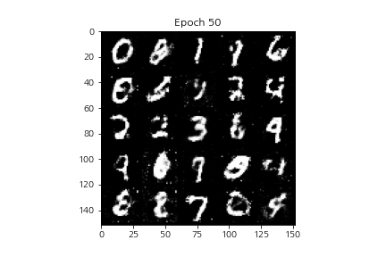
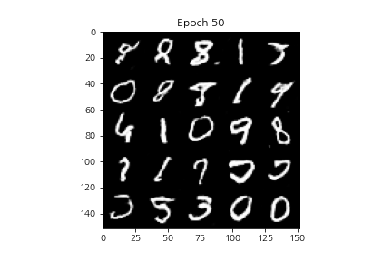
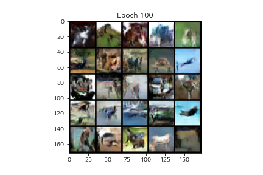
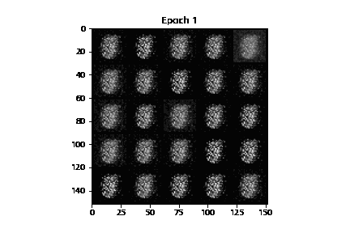
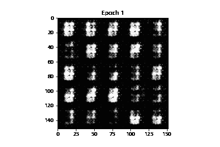

# GAN_tutorial with PyTorch
### MNIST & CIFAR10 데이터 셋을 이용한 GAN/DCGAN의 구현
### paper
[[Generative Adversarial Nets]](https://arxiv.org/pdf/1406.2661.pdf)  
***************
## Description

* model: 학습된 Generator, Discriminator가 저장됨.  
* result: 각 데이터 셋/ 모델 구조에 따른 이미지 생성 결과가 저장됨.  
* ipynb 파일:   
	- [x] GAN_pseudo.ipynb: GAN 학습의 이해를 돕기 위한 pseudo code
	- [x] MNIST_GAN.ipynb: MNIST를 이용한 GAN 학습
	- [x] MNIST_DCGAN.ipynb: MNIST를 이용한 DCGAN 학습
	- [x] CIFAR10_DCGAN.ipynb: CIFAR10을 이용한 DCGAN 학습
***************
## Model architecture
* GAN

***************
## Resutls
#### Final epoch
<table align='center'>
<tr align='center'>
<td> MNIST GAN (epoch:50)</td>
<td> MNIST DCGAN (50)</td>
<td> CIFAR10 DCGAN (100)</td>
</tr>
<tr>
<td>
<td>
<td>
</tr>
</table>

#### MNIST
<table align='center'>
<tr align='center'>
<td> GAN</td>
<td> DCGAN</td>
</tr>
<tr>
<td>
<td>
</tr>
</table>

#### CIFAR10
<table align='center'>
<tr align='center'>
<td> DCGAN</td>
</tr>
<tr>
<td>
</tr>
</table>

